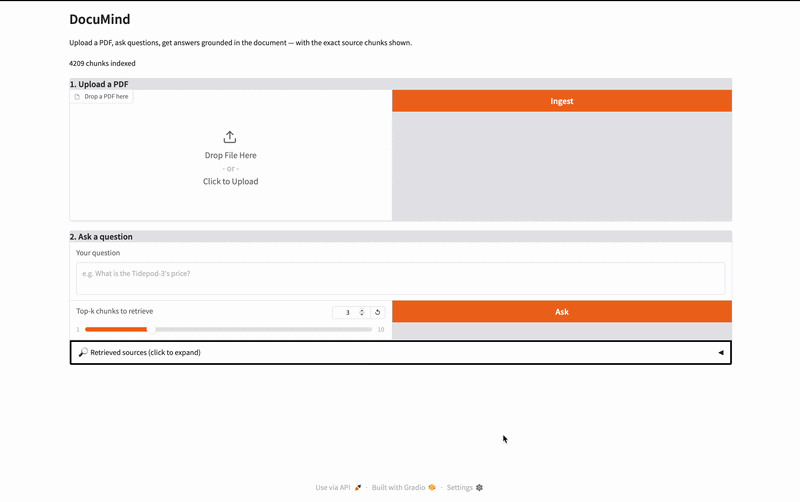
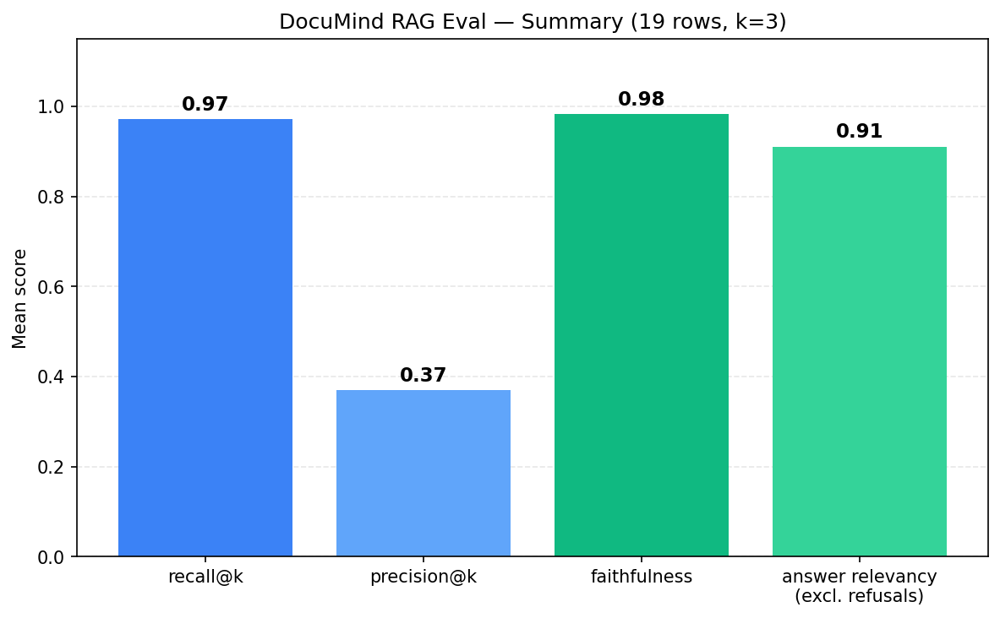
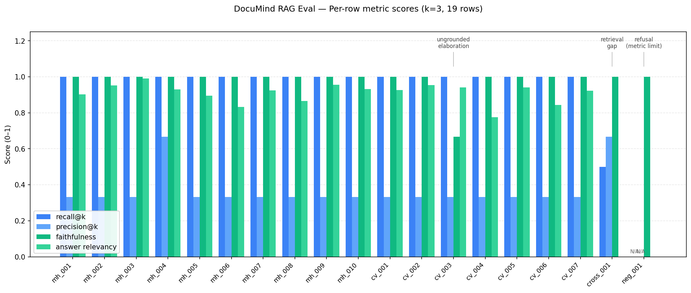

# DocuMind

> A RAG system for PDF question answering. Upload your documents, ask questions, get answers with cited sources — backed by FastAPI, LangChain, ChromaDB, and OpenAI, deployed on Render. Built to learn how production RAG system works.



**Live demo:** [https://documind-bsa2.onrender.com/ui/](https://documind-bsa2.onrender.com/ui/) 


---
## Motivation 

I had built models from scratch using PyTorch (GPT , Vision Transformer , Multimodal Image Captioning) , but never deployed anything in a production like enviornement where users can interact.

## Update (July 2026) 

**Migrated from AWS EC2 to Render**: Changed the hosting of the app in EC2 to free hosting using Render , to cut the cost of hosting , Now you can access Documind on this link.
→ Try it live: [https://documind-bsa2.onrender.com/ui/](https://documind-bsa2.onrender.com/ui/)

## Update (June 2026)

Two recent additions:

**1. Web UI** — A Gradio interface mounted at `/ui` for non-technical users. Upload a PDF, ask questions, see the exact retrieved chunks with similarity scores. Mounted inside the existing FastAPI app — one container, one deployment.
→ Try it live: [https://documind-bsa2.onrender.com/ui/](https://documind-bsa2.onrender.com/ui/)

**2. Custom RAG evaluation harness:**
- **Retrieval metrics from scratch:** recall@k (0.97) and precision@k (0.37) the classic see-saw, in real data.
- **Generation metrics via RAGAS:** faithfulness (0.98) and answer relevancy (0.91 excl. refusals) LLM-as-judge with documented limitations.
- **A working framework for reading metric output critically:** artifact vs. true signal vs. metric limitation each calling for a different response.

→ [See the full Evaluation section](#evaluation) for charts, per-row analysis, and how I debugged the metrics themselves.
---

## What it does

DocuMind is an end-to-end document question-answering backend. Upload a PDF and it:

1. **Ingests** the document — extracts text, splits into semantic chunks, embeds each chunk into a vector store
2. **Retrieves** relevant chunks when you ask a question (semantic similarity search)
3. **Generates** a grounded answer only based on the sources using GPT, returning the answer along with the source chunks it cited

Idempotent ingestion (re-uploading the same PDF doesn't duplicate chunks). Async query handling. Handle error gracefully if you upload image-only PDFs.

---

## Architecture

### Ingestion pipeline

```
User PDF upload
       │
       ▼
LangChain PyPDFLoader  →  extracts text per page
       │
       ▼
RecursiveCharacterTextSplitter  →  ~800-char chunks, 150-char overlap
       │
       ▼
OpenAI text-embedding-3-small  →  1536-d vector per chunk
       │
       ▼
ChromaDB  →  stores vector + text + metadata, keyed by SHA-256 chunk ID
```

### Query pipeline

```
User question
       │
       ▼
Embed question (same model)
       │
       ▼
ChromaDB similarity search  →  top-k relevant chunks
       │
       ▼
GPT-4o-mini  →  generates answer grounded in retrieved chunks
       │
       ▼
Response  →  { answer, sources[], metadata }
```

### Deployment topology

```
Browser
   │ HTTPS (Let's Encrypt cert, auto-renewing)
   ▼
Cloudflare DNS  →  AWS Elastic IP  →  AWS EC2 (Ubuntu 26.04)
                                          │
                                          ▼
                                   Nginx reverse proxy (:443)
                                          │
                                          ▼
                                   Docker container → FastAPI :8000
                                          │
                                          ▼
                                   LangChain + ChromaDB + OpenAI API
```

---

## Tech stack

| Layer | Tools |
|---|---|
| **API** | FastAPI, Pydantic, async/await, Uvicorn |
| **RAG** | LangChain, ChromaDB (persistent vector store), OpenAI API |
| **LLM** | `gpt-4o-mini` (responses), `text-embedding-3-small` (embeddings) |
| **Deployment** | Docker, AWS EC2, Nginx (reverse proxy), Let's Encrypt (SSL), Cloudflare DNS |
| **Observability** | Structured JSON logging (structlog), custom exception middleware |
| **Testing** | pytest, pytest-asyncio, FastAPI TestClient, mocked LLM/vectorstore |

---

## API endpoints

| Method | Path | Description |
|---|---|---|
| `GET` | `/` | API metadata + entry points |
| `GET` | `/health` | Health check |
| `POST` | `/ingest` | Upload a PDF; returns `{ filename, file_hash, pages, chunks }` |
| `POST` | `/query` | Body: `{ question, k }`; returns answer with cited source chunks |
| `GET` | `/docs` | Interactive Swagger UI |

Explore live at [documind.mroshan454.dev/docs](https://documind.mroshan454.dev/docs).

---

## Running locally

### Prerequisites

- Python 3.11+
- Docker & Docker Compose
- An OpenAI API key

### Quick start (Docker — recommended)

```bash
# 1. Clone
git clone https://github.com/mroshan454/documind.git
cd documind

# 2. Create .env with your OpenAI key
echo "OPENAI_API_KEY=sk-..." > .env

# 3. Build + run
docker compose up -d --build

# 4. Open Swagger UI
open http://localhost:8000/docs
```

### Without Docker

```bash
# 1. Clone + set up venv
git clone https://github.com/mroshan454/documind.git
cd documind
python -m venv venv
source venv/bin/activate

# 2. Install
pip install -r requirements.txt

# 3. Export OPENAI_API_KEY (or use .env + python-dotenv)
export OPENAI_API_KEY=sk-...

# 4. Run
uvicorn app.main:app --reload
```

### Running tests

```bash
pytest                    # full suite
pytest -v --tb=short      # verbose
pytest tests/integration  # integration tests only
```

---

## Production engineering highlights

A few decisions I made while deploying the application.

### Reduced Docker image from 8.9 GB → under 1 GB

The first build shipped 8.9 GB of dependencies. Found out the problem was PyTorch pulling in 7 GB of CUDA libraries to support HuggingFace's `sentence-transformers/all-MiniLM-L6-v2` embedding model — which doesn't runs on a CPU-only EC2 instance.

**Tradeoff analysis:**

| Option | Image size | Inference cost | Latency |
|---|---|---|---|
| Local HF embeddings (CPU) | 8.9 GB | $0 | slow on CPU |
| Local HF embeddings (GPU) | 8.9 GB | + GPU instance cost | fast |
| OpenAI embeddings API | < 1 GB | ~$0.02 per 1M tokens | low (network) |

To avoid the size (8.9GB) I chose **OpenAI embeddings** — for portfolio-scale traffic the per-document cost is ~$0.001, and shrinking the image meaningfully improves cold-start time and reduces EC2 disk usage. If this scaled to enterprise volumes (millions of documents), the math would flip and local GPU embeddings would win.

### Idempotent ingestion with SHA-256 chunk IDs

Re-uploading the same PDF used to create duplicate chunks. Fixed by hashing the file contents and using deterministic IDs (`<sha256>-chunk-<i>`) for ChromaDB upserts. Same file → same IDs → upsert overwrites cleanly.

### Custom exception hierarchy

A user uploaded an image-only PDF (scanned/rasterized text). PyPDFLoader returned zero characters. The system crashed with a 500 stack trace. Replaced with:

```python
class EmptyDocumentError(IngestionException):
    status_code = 400
    error_code = "no_extractable_text"
    message = "No extractable text found. The PDF may be a scanned or image-only document."
```

Caught in the endpoint, returns a clean HTTP 400 with `{ error_code, message }`. Useful both for UX and for debugging.

### Async LangChain integration

Query path uses `ainvoke()` so multiple concurrent queries don't block on each other's OpenAI round-trips. Tested with `pytest-asyncio`.

### Structured logging

Every request emits JSON logs with `event`, `level`, `timestamp`, plus context (`filename`, `pages`, `chunks`, `file_hash`).

---

---

## Evaluation

DocuMind includes a custom RAG evaluation harness covering both retrieval and generation. Metrics are computed against a 19-row, hand-authored, human-verified ground-truth set spanning two documents  (a fictional company fact sheet and my own real CV) ingested into the same vector store.

### Summary (k = 3, 19 rows)



| Metric              | Score | What it measures |
|---------------------|-------|------------------|
| **recall@k**        | 0.97  | Did retrieval find the chunks it should have? |
| **precision@k**     | 0.37  | Of the chunks it retrieved, how many were relevant? |
| **faithfulness**    | 0.98  | Are the answer's claims grounded in the retrieved chunks? (RAGAS / LLM-judge) |
| **answer relevancy** | 0.91 *(excl. refusals)* | Does the answer actually address the question? (RAGAS / embedding similarity) |

- Retrieval metrics implemented from scratch (substring matching with Unicode-aware normalisation: whitespace collapse, punctuation stripping).
- Generation metrics computed via [RAGAS](https://github.com/explodinggradients/ragas) with `gpt-4o-mini` as the judge and `text-embedding-3-small` for relevancy.
- Full per-row results: [`eval/eval_summary.csv`](eval/eval_summary.csv) · Harness code: [`eval/run_eval.py`](eval/run_eval.py), [`eval/metrics.py`](eval/metrics.py), [`eval/ragas_faithfulness.py`](eval/ragas_faithfulness.py)

### Per-row scores



Three rows are intentionally created to stress the system and reveal where single-number averages would lie:

| Row | Recall | Precision | Faithfulness | Relevancy | What it reveals |
|---|---|---|---|---|---|
| `cv_003` | 1.00 | 0.33 | **0.67** | 0.94 | Model added accurate-but-ungrounded explanation beyond the retrieved context — a true (mild) faithfulness signal. |
| `cross_001` | **0.50** | 0.67 | 1.00 | **0.00** | Cross-document multi-hop retrieval gap: only 1 of 2 needed passages was retrieved. Answer was perfectly faithful to what it *did* receive. |
| `neg_001` | N/A | N/A | 1.00 | **0.00** | Negative test (question unanswerable from corpus). Model correctly refused. |

### Three categories of "bad" metric output

The most useful thing this whole eval process taught me wasn't about the system , it was about how to read metric scores carefully. Whenever a score is below 1.0, the reason falls into one of three categories, and each one needs a different response:

**1. Artifact — the measurement itself is wrong.**
The initial faithfulness average was 0.89, with four rows stuck at exactly 0.50. Here's what was happening: RAGAS was breaking each short factual answer into two parts , the actual fact (which the chunks supported) and the (Source: …) citation tag at the end. Since filenames don't appear inside the chunk text, the judge couldn't verify the citation and marked it as unsupported → 1 supported out of 2 = 0.50. So the metric wasn't actually catching hallucinations; it was punishing the answer for following the prompt's own "always cite the source" instruction. After stripping the citation tags before scoring, faithfulness jumped to 0.98.
Response: fix the measurement.

**2. True signal — the metric is correctly catching a real problem in the system.** 
cv_003 scored faithfulness 0.67. The answer included the line "ensures unique identifier, allowing consistent processing without duplication" , which is true in general, but the retrieved chunks never actually said this. The model pulled this extra explanation from its own training, not from the document. That's a mild form of unfaithfulness, and the metric caught it correctly.
Response: either fix the system (update the prompt to stop the model from adding its own explanations) or accept that being too strict can make answers less helpful, and just document the tradeoff.

**3.Limitation — the metric is just not good at scoring this type of answer.** 
Refusal answers (neg_001, cross_001) scored answer relevancy = 0.00, even though the answers were correct, honest, and faithful. Here's why: RAGAS's relevancy check works by generating a question from the answer and comparing it to the original question. But a refusal answer like "this information isn't in the context" generates a question like "is this information available?" m which is very different from the original "what is X?". So the similarity score drops to zero, even though the answer was the right thing to say. The metric simply isn't designed to score refusals fairly, no matter how appropriate they are.
Response: just document the limitation, and report relevancy excluding refusal rows as the more honest number (0.91).

### Why retrieval and generation metrics need to be reported separately
cross_001 is the clearest example of why you need both kinds of metric, not just one. Its scores were:

recall = 0.50 — retrieval only found half the chunks it needed.
faithfulness = 1.00 , but the answer itself was perfect, given what it received. The model correctly said "this comparison isn't possible" instead of making up a fake PlantNet39(A project From My CV)  lifespan.

If we'd only looked at one combined score, this would've been hidden. Faithfulness measures the answer against what the model was actually given , not what it should have been given. So a model can be perfectly faithful even when retrieval has failed, and you'd never know unless you look at both numbers side by side.

### Why the corpus is small (being honest about it)
The corpus has only 13 chunks, which makes retrieval pretty easy , with k=3, we're already grabbing almost a quarter of all the chunks for every query. So a high recall score here is partly because the corpus is small, not because retrieval is amazing. The harness itself works correctly, though, and is ready to be used on a much larger corpus where the recall number would actually mean something. Even at this small scale, it still caught one real cross-document retrieval gap which is encouraging.

### Reproducing

```bash
# 1. capture: run all eval queries through the live /query endpoint
python eval/run_eval.py

# 2. retrieval metrics (mechanical, instant, free)
python eval/metrics.py

# 3. generation metrics (LLM-judge via RAGAS, ~2–3 minutes, ~30¢ OpenAI cost)
python eval/ragas_faithfulness.py
```

Eval set lives at [`eval/documind_eval_set.json`](eval/documind_eval_set.json). Captured outputs at [`eval/eval_results.json`](eval/eval_results.json).

---

## Project structure

```
documind/
├── app/
│   ├── main.py                # FastAPI app + endpoints + exception handlers
│   ├── core/
│   │   ├── exceptions.py      # Custom exception hierarchy
│   │   └── logging.py         # structlog configuration
│   └── services/
│       ├── ingestion_service.py   # PDF load → split → embed → store
│       └── query_service.py       # Retrieve → prompt → LLM → answer
├── tests/                     # pytest unit + integration tests
├── eval/                      # New : Added RAG evaluation harness (4 metrics, charts, analysis)
├── uploads/                   # Mounted volume for incoming PDFs
├── chroma_db/                 # Persistent vector store (mounted volume)
├── Dockerfile
├── docker-compose.yml
├── requirements.txt
└── README.md
```

---


## Further Works

- [ ] **OCR support** — Tesseract integration for scanned / image-only PDFs (currently returns HTTP 400)
- [ ] **Agentic retrieval** — multi-step retrieval with query refinement
- [ ] **Rate limiting** — per-IP request limits at the Nginx layer
- [ ] **Streaming responses** — Server-Sent Events for token-by-token output
- [ ] **Conversational memory** — multi-turn QA over the same document

---

## License

MIT. See `LICENSE`.

---


## About

Built by [Roshan Mohammed](https://linkedin.com/in/roshan-mohammed-068008279), MSc AI graduate
- 🌐 Live demo: [https://documind-bsa2.onrender.com/ui/](https://documind-bsa2.onrender.com/ui/)
- 🐙 GitHub: [github.com/mroshan454](https://github.com/mroshan454)
- 🤗 Hugging Face: [huggingface.co/roshan454](https://huggingface.co/roshan454)
- 💼 LinkedIn: [in/roshan-mohammed-068008279](https://linkedin.com/in/roshan-mohammed-068008279)
